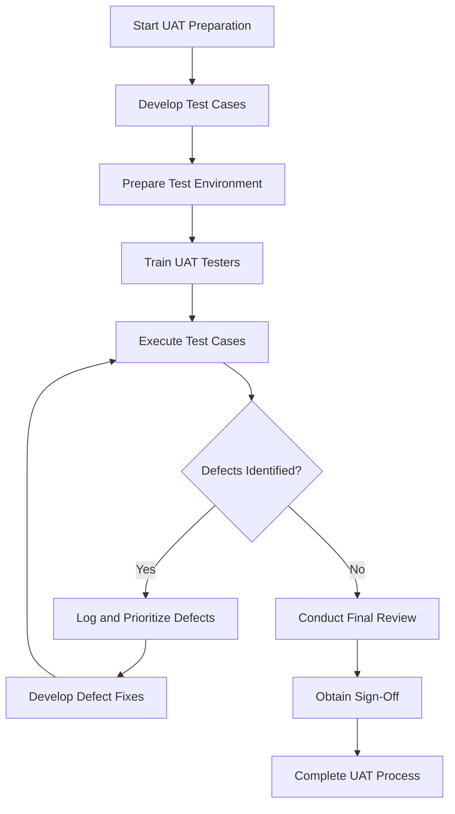

# User Acceptance Testing (UAT) Development Plan

## 1. UAT Testing Strategy Overview

| Aspect | Description | Details |
|--------|-------------|---------|
| **Objective** | Validate system functionality from end-user perspective | Ensure the system meets business requirements and user expectations |
| **Scope** | Comprehensive testing of entire system or specific modules | Includes functional, usability, and performance aspects |
| **Approach** | Collaborative testing with business users | Direct involvement of end-users in testing process |

## 2. UAT Testing Plan Components

| Phase | Key Activities | Deliverables |
|-------|----------------|--------------|
| **1. Preparation** | - Gather comprehensive requirements - Define UAT objectives - Identify key stakeholders | - Requirements Traceability Matrix - UAT Strategy Document |
| **2. Test Case Development** | - Create detailed test scenarios - Map test cases to requirements - Develop test scripts | - Comprehensive Test Case Repository - Test Scenario Documentation |
| **3. Environment Preparation** | - Set up UAT test environment - Prepare test data - Configure test accounts | - Fully Configured Test Environment - Realistic Test Data Sets |
| **4. Test Execution** | - Conduct systematic testing - Document test results - Track and manage defects | - Test Execution Logs - Defect Tracking Report |
| **5. Validation & Sign-Off** | - Review test results - Validate system against requirements - Obtain stakeholder approval | - UAT Sign-Off Document - Final Acceptance Report |

## 3. UAT Test Case Development Approach

| Development Stage | Key Considerations | Methodology |
|------------------|---------------------|--------------|
| **1. Requirement Analysis** | - Review functional specifications - Identify critical business processes | - Collaborative workshops - Stakeholder interviews |
| **2. Scenario Identification** | - Map user workflows - Cover positive and negative scenarios | - User journey mapping - Process flow analysis |
| **3. Test Case Creation** | - Develop detailed, step-by-step test cases - Include expected outcomes | - Template-based approach - Traceability to requirements |

## 4. UAT Test Case Template

| Test Case ID | Requirement ID | Business Process | Detailed Steps | Expected Result | Actual Result | Status | Priority |
|--------------|----------------|-----------------|----------------|-----------------|---------------|--------|----------|
| UAT-001 | REQ-LOGIN-001 | User Authentication | 1. Navigate to login page 2. Enter valid credentials 3. Verify dashboard access | Successful login and correct user role access | - | Not Tested | High |
| UAT-002 | REQ-ORDER-001 | Product Ordering | 1. Browse product catalog 2. Select product 3. Complete order process | Order confirmation with correct details | - | Not Tested | Critical |

## 5. Stakeholder Involvement Matrix

| Stakeholder Group | Role | Responsibilities | Involvement Level |
|-------------------|------|-----------------|-------------------|
| **Business Users** | Primary Testers | - Execute test cases - Validate business processes | High |
| **IT Department** | Support & Technical Validation | - Environment setup - Technical support | Medium |
| **Project Manager** | Coordination & Oversight | - Manage testing process - Track progress | High |
| **Subject Matter Experts** | Domain Validation | - Verify domain-specific requirements - Provide specialized insights | Medium |

## 6. Defect Management Process

| Defect Severity | Description | Impact | Action Priority |
|-----------------|-------------|--------|-----------------|
| **Critical** | System-blocking issues | Prevents core functionality | Immediate Resolution |
| **High** | Major functional deviations | Significant business process disruption | Urgent Fix Required |
| **Medium** | Partial functionality issues | Moderate impact on user experience | Planned Resolution |
| **Low** | Cosmetic or minor issues | Minimal operational impact | Optional Improvement |

## 7. UAT Testing Workflow

## 8. Testing Environment Considerations

| Environment Aspect | Requirements | Validation Criteria |
|--------------------|--------------|---------------------|
| **System Access** | - Realistic user roles - Appropriate access levels | Matches production environment |
| **Data Preparation** | - Anonymized production-like data - Comprehensive test scenarios | Represents real-world use cases |
| **Performance** | - Mimics production infrastructure - Adequate response times | Meets performance benchmarks |

## 9. UAT Documentation Requirements

| Document Type | Purpose | Key Contents |
|---------------|---------|--------------|
| **Test Plan** | Guide the UAT process | - Objectives - Scope - Approach |
| **Test Cases** | Detailed testing instructions | - Step-by-step procedures - Expected outcomes |
| **Defect Log** | Track and manage issues | - Defect details - Severity - Resolution status |
| **Final Report** | Summarize UAT outcomes | - Overall test results - Key findings - Sign-off recommendation |

## 10. Recommendations for Successful UAT

1. **Clear Communication**: Maintain transparent communication channels
2. **Comprehensive Preparation**: Invest time in thorough test case development
3. **Stakeholder Engagement**: Ensure active participation from all key stakeholders
4. **Continuous Feedback**: Implement iterative feedback mechanisms
5. **Realistic Expectations**: Set clear, achievable testing objectives

## 11. Risk Mitigation Strategies

| Risk Category | Potential Risks | Mitigation Approaches |
|---------------|-----------------|----------------------|
| **Scope Creep** | Expanding test requirements | - Clear initial scoping - Change management process |
| **Resource Constraints** | Limited tester availability | - Early resource planning - Backup tester identification |
| **Technical Challenges** | Environment or access issues | - Comprehensive environment testing - Technical support readiness |

## 12. UAT Completion Criteria

| Criterion | Detailed Requirements | Verification Method |
|-----------|----------------------|---------------------|
| **Functional Completeness** | - All critical features tested - 100% requirement coverage | Requirement traceability matrix |
| **Defect Resolution** | - All critical defects resolved - Acceptable number of minor issues | Defect management log |
| **Stakeholder Approval** | - Business user sign-off - Management acceptance | Formal sign-off documentation |
