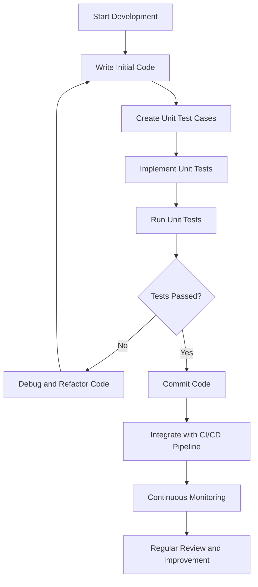

# Unit Testing Development Plan

## 1. Unit Testing Strategy Overview

| Aspect | Description | Details |
|--------|-------------|---------|
| **Objective** | Validate individual components and functions | Ensure each unit of code performs as expected in isolation |
| **Scope** | Comprehensive testing of all software components | Cover critical paths, edge cases, and potential failure scenarios |
| **Testing Approach** | Test-Driven Development (TDD) & Behavior-Driven Development (BDD) | Integrate unit testing throughout the development lifecycle |

## 2. Unit Testing Plan Components

| Phase | Key Activities | Deliverables |
|-------|----------------|--------------|
| **1. Preparation** | - Define testing standards - Select testing frameworks - Establish code coverage goals | - Unit Testing Guidelines - Framework Selection Document |
| **2. Test Design** | - Create test cases for each component - Define test scenarios - Develop test data sets | - Detailed Test Case Specifications - Test Data Repository |
| **3. Implementation** | - Write unit tests - Integrate with CI/CD pipeline - Implement continuous testing | - Unit Test Scripts - Automated Testing Configurations |
| **4. Execution & Monitoring** | - Run unit tests - Analyze test results - Identify and fix defects | - Test Execution Reports - Defect Tracking Log |
| **5. Reporting & Improvement** | - Generate coverage reports - Review testing effectiveness - Continuously refine tests | - Code Coverage Reports - Testing Improvement Recommendations |

## 3. Unit Testing Framework Selection

| Framework | Language | Key Features | Recommended Use |
|-----------|----------|--------------|-----------------|
| **JUnit** | Java | - Annotations - Assertions - Test Runners | Enterprise Java Applications |
| **NUnit** | .NET | - Attribute-based - Constraint-based assertions - Parameterized tests | .NET and C# Projects |
| **PyTest** | Python | - Simple syntax - Powerful fixtures - Detailed reporting | Python Applications |
| **Jest** | JavaScript/React | - Snapshot testing - Mocking capabilities - Code coverage | JavaScript and React Projects |
| **Mocha** | Node.js | - Flexible testing - Supports multiple assertion libraries - Asynchronous testing | Node.js Applications |

## 4. Unit Test Case Template

| Test Case ID | Component | Method/Function | Test Scenario | Input | Expected Output | Actual Output | Status |
|--------------|-----------|-----------------|---------------|-------|-----------------|---------------|--------|
| UT-001 | User Authentication | validateLogin() | Valid Credentials | username, password | true | - | Not Tested |
| UT-002 | User Authentication | validateLogin() | Invalid Credentials | invalid username, password | false | - | Not Tested |

## 5. Code Coverage Targets

| Coverage Level | Description | Target Percentage |
|---------------|-------------|-------------------|
| **Minimum Acceptable** | Basic functionality coverage | 70% |
| **Good** | Comprehensive component testing | 80-90% |
| **Excellent** | Near-complete code path coverage | 90-100% |

## 6. Unit Testing Best Practices

| Practice | Description | Implementation Guidelines |
|----------|-------------|----------------------------|
| **1. Isolation** | Test each unit independently | - Mock external dependencies - Use dependency injection |
| **2. FIRST Principles** | Fast, Independent, Repeatable, Self-validating, Timely | - Keep tests quick - Ensure no test dependencies |
| **3. Boundary Testing** | Test edge cases and extreme scenarios | - Test minimum and maximum values - Check error handling |
| **4. Negative Testing** | Validate error handling and exceptions | - Test invalid inputs - Verify proper error responses |

## 7. Defect Classification for Unit Tests

| Severity | Description | Impact | Action Required |
|----------|-------------|--------|-----------------|
| **Critical** | Fundamental logic failure | Breaks core functionality | Immediate fix |
| **High** | Significant logic deviation | Impacts critical paths | Urgent resolution |
| **Medium** | Minor logic inconsistency | Potential edge case issues | Planned fix |
| **Low** | Cosmetic or minor logic variances | Minimal impact | Optional improvement |

## 8. Unit Testing Workflow

## 9. Tools and Infrastructure

| Category | Recommended Tools | Purpose |
|----------|-------------------|---------|
| **Testing Frameworks** | JUnit, NUnit, PyTest, Jest | Unit test execution |
| **Code Coverage** | JaCoCo, Istanbul, Coverage.py | Measure test coverage |
| **Mocking** | Mockito, Moq, unittest.mock | Simulate dependencies |
| **Continuous Integration** | Jenkins, GitLab CI, GitHub Actions | Automated testing |

## 10. Recommendations

1. **Early Integration**: Incorporate unit testing from the project's inception
2. **Continuous Learning**: Regularly update testing strategies
3. **Team Training**: Conduct workshops on effective unit testing
4. **Tool Evaluation**: Periodically assess and update testing tools
5. **Metrics Tracking**: Monitor and improve code coverage and test effectiveness

## 11. Reporting and Metrics

| Metric | Description | Tracking Method |
|--------|-------------|-----------------|
| **Code Coverage** | Percentage of code tested | Automated reporting tools |
| **Test Execution Time** | Time taken to run unit tests | CI/CD pipeline metrics |
| **Defect Detection Rate** | Number of issues found through unit testing | Defect tracking system |
| **Test Pass/Fail Ratio** | Proportion of passed to failed tests | Continuous monitoring |
